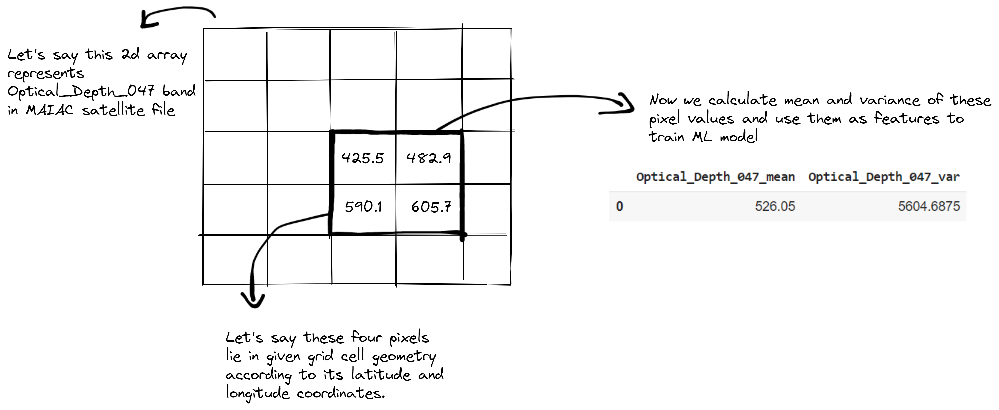
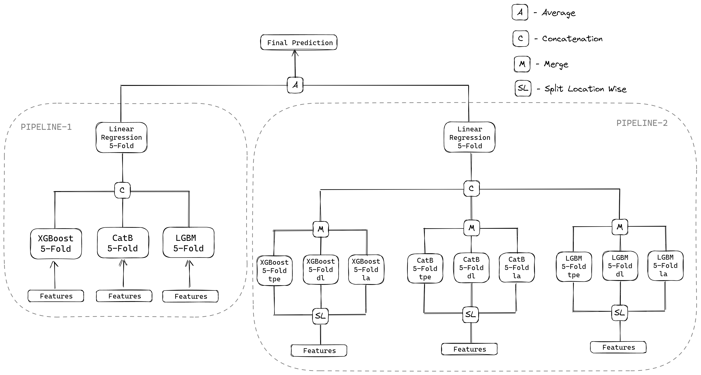

# NASA Airathon

**Username:** [vstark21](https://www.drivendata.org/users/vstark21/)

**Data sources used:** MAIAC, MISR, GFS, NASADEM

## Summary

##### Processing data

* Firstly, for each data product, for each instance in train data and test data, we select the latest satellite file whose `satellite_time_end < observation_time_end` and then for each band in the file, we select pixels whose global coordinates lies in given grid cell polygon and take their mean and variance as features. The processed features for each data product are stored in `.csv` format in `data/proc` directory. You can find preprocessing notebooks for each data product in `notebooks/` directory. 
  
  

The `data` folder should have the following structure:

```
data
├── grid_metadata.csv
├── pm25_satellite_metadata.csv
├── proc
├── raw
│   ├── proc_data
│   ├── test_gfs_data
│   └── train_gfs_data
├── submission_format.csv
└── train_labels.csv
```

##### Imputation

* After collecting the features from all the data products (maiac, misr, gfs, nasadem) in the above mentioned way, we might find `nan` values in some feature columns in the dataframe. We perform *grid wise mean imputation*.
  
  ```python
  # Following code shows grid wise mean imputation
  # Here train_df, test_df contains collected features using above method
  # from all data products
  # train_metadata: train_labels.csv file
  
  feat_columns = [col for col in train_df.columns if col != 'grid_id']
  for grid_id in train_metadata['grid_id'].unique():
      for col in feat_columns:
          indices = train_df[train_df['grid_id'] == grid_id].index
          mean_val = train_df.loc[indices, col].mean()
          train_df.loc[indices, col] = train_df.loc[indices, col].fillna(mean_val)
  
          indices = test_df[test_df['grid_id'] == grid_id].index
          test_df.loc[indices, col] = test_df.loc[indices, col].fillna(mean_val)
  ```

##### Feature Engineering

* After performing imputation, we now create grid wise temporal difference features in the following way.
  
  ```python
  # Let's say today and yesterday contains features for predicting today's 
  # yesterday's concentration respectively. 
  # NOTE: today and yesterday must belong to same grid cell
  
  for col in feat_columns:
      today[col + '_temporal_diff'] = today[col] - yesterday[col]
  ```

* And then we create features from metadata which includes location, month, day and grid wise mean value.
  
  ```python
  # Grid wise mean value is calculated in following way
  # train_metadata: train_labels.csv file
  # test_metadata: submission_format.csv file
  train_df['mean_value'] = train_metadata['grid_id'].apply(
      lambda x: train_metadata[train_metadata['grid_id'] == x]['value'].mean()
  )
  test_df['mean_value'] = test_metadata['grid_id'].apply(
      lambda x: train_metadata[train_metadata['grid_id'] == x]['value'].mean()
  )
  ```

##### Modeling

* After feature engineering, we train each model of the architecture shown below. Entire architecture consists of 14 models each of which is a self-ensemble of 5-folds. All the model hyperparameters were tuned using Optuna.
  
  

## Repo structure

```bash
.
├── README.md 
├── assets
├── configs                   # Contains config files for training and inference
    ├── predict.yml
    ├── pipeline_0.yml
    ├── model_0.yml
    └── ...
├── data
    ├── backup                # Contains backup files
    ├── proc                  # Contains processed data
    ├── raw                   # Contains raw, unprocessed data
    ├── train_labels.csv
    ├── grid_metadata.csv
    └── ...
├── models                    # Must contain trained weights
├── notebooks                 # Contains raw-data processing and EDA notebooks
├── src
    ├── data                  # Contains data pre-processing and feature engineering functions
    ├── models                # Contains modelling functions
    ├── inference             # Contains data downloading functions for inference
    ├── visualization         # Contains visualization functions
    └── utils                 # Contains utility functions
├── create_submission.py      # Runs inference on entire test data and creates submission
├── requirements.txt          # Contains all dependencies required except rasterio
├── predict.py                # Contains inference code for a single data point
├── train.py                  # Contains single model training code
├── train_locwise.py          # Contains location wise single model training code
├── train_pipeline.py         # Contains pipeline training code 
└── train_locwise_pipeline.py # Contains location wise pipeline training code
```

## Setup

Download and install [anaconda](https://docs.anaconda.com/anaconda/install/index.html) or [miniconda](https://docs.anaconda.com/anaconda/install/index.html). Execute the following commands to create a conda environment *nasa_env* and then install all the dependencies.

```bash
conda create -n nasa_env python==3.9
conda activate nasa_env
conda install -c conda-forge rasterio
conda install -c conda-forge pygrib
pip install -r requirements.txt
```

And download the trained weights from [here](https://drive.google.com/file/d/1K7331_L2tk7EzdXBArgN9cLNvlMnpFV9) and unzip it. Or execute the following commands to download and unzip the trained weights. 

```bash
$ conda activate nasa_env
$ pip install gdown
$ gdown https://drive.google.com/uc?id=1K7331_L2tk7EzdXBArgN9cLNvlMnpFV9
$ unzip models.zip
```

## Hardware

```
CPU: Intel(R) Core(TM) i5-8265U CPU @ 1.60GHz (8 CPUs)
GPU: No gpus were used in training
Memory: 8GB
OS: Windows 11 Home Single Language 64-bit
Train Duration: 26 mins (without including data downloading and pre-processing)
Inference Duration: Around 30 mins to predict one day’s concentrations for all the grids in three cities (Including data downloading and pre-processing)
Time taken to process MAIAC data for train and test instances: Around 17 hours
Time taken to process MISR data for train and test instances: Around 2 hours
Time taken to process GFS data for train and test instances: Around 10 hours
Time taken to process NASADEM data for train and test instances: Around 1 hour
```

## Run Training

As the final workflow contains two pipelines, we need to train two pipelines. I provided the processed files in `data/proc` directory, if you wish to create those processed files for each data product you can find processing notebooks in `notebooks/` directory. As the training files use processed files, make sure `data/proc` directory has processed csv files.

```bash
# Training pipeline-1, see the figure in modeling
$ python train_pipeline.py --config configs/pipeline_0.yml
# Training pipeline-2, see the figure in modeling
$ python train_locwise_pipeline.py --config configs/pipeline_1.yml
```

## Run Inference

`predict.py` file will run inference on a given datetime and grid id, it also expects a `.csv` satellite file similar to `data/pm25_satellite_metadata.csv` whose temporal range is near the given datetime. It also expects NCAR credentials in order to login into the NCAR website and download GFS data.

```
$ python predict.py --help
usage: predict.py [-h] [--config CONFIG] [--observation_start_time OBS_START_TIME] [--grid_id GRID_ID]
                  [--satdata_file SATDATA_FILE] --ncar_email NCAR_EMAIL --ncar_pswd NCAR_PSWD

optional arguments:
  -h, --help            show this help message and exit
  --config CONFIG       Path to the config file
  --observation_start_time OBS_START_TIME
                        Observation start time in YYYY-MM-DDTHH:mm:ssZ format
  --grid_id GRID_ID     Grid ID
  --satdata_file SATDATA_FILE
                        Path to the satellite data file which contains maiac and misr satellite data
                        information
  --ncar_email NCAR_EMAIL
                        Email address to login to NCAR website to download GFS data
  --ncar_pswd NCAR_PSWD
                        Password to login to NCAR website to download GFS data
```

Following shows an example to run `predict.py` file.

```bash
$ python predict.py --config "configs/predict.yml" --observation_start_time "2021-03-02T18:30:00Z" --grid_id "C7PGV" --satdata_file "data/pm25_satellite_metadata.csv" --ncar_email <username> --ncar_pswd <password>
```

In order to predict on test data and create final submission, you can run following command. `create_submission.py` file doesn't download or process data, it uses processed test files which are in `data/proc` directory (which were created using notebooks in `notebooks/` directory). By default submission file is saved to `data/proc/submission.csv'`.

```
$ python create_submission.py
```
